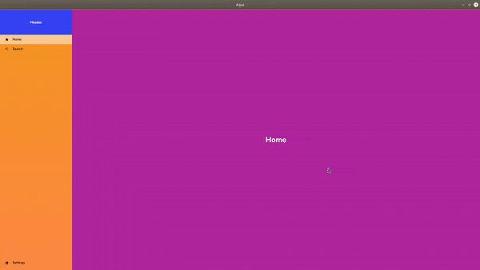

# window_manager
view switching for desktop apps built with Flutter

**`FLUTTER DEVICES`** [Window Navigator](#window-navigator), a bit of boilerplate code is needed for this to work ...<br>
To setup your environment for mobile, click [here](https://flutter.dev/)
To setup your environment for desktop, click [here](https://flutter.dev/desktop)

Copy paste the code below to render a screen like this:<br/>


```dart
import 'dart:async';
import 'package:flutter/material.dart';
import 'package:aqua/aqua.dart' as aqua;

class Shell extends StatefulWidget {

  @override
  ShellState createState() => ShellState();
}

class ShellState extends State<Shell>{

  Widget selectedWidget;
  aqua.NavigationStreamer mainNavStreamer;
  StreamSubscription mainNavStreamSubscription;

  @override
  void initState(){
    super.initState();
    mainNavStreamer = aqua.NavigationStreamer();

    mainNavStreamSubscription = mainNavStreamer.listen((data){
      aqua.pretifyOutput('[SHELL] data from nav stream: $data');

      selectedWidget = data['window'];
      setState((){});
    });
  }

  @override
  void dispose(){
    mainNavStreamSubscription.cancel();
    mainNavStreamer.close();
    super.dispose();
  }

  Widget _buildShell(BuildContext context){
    Map<String, Map<String, dynamic>> generatedRoutes = _buildGeneratedRoutes();

    var textStyle = TextStyle(
      fontSize: 30.0,
      color: Colors.white,
      fontWeight: FontWeight.bold
    );

    Widget firstWidget = Container(
      color: Colors.purple,
      child: Center(
        child: Text(
          'Home',
          style: textStyle
        )
      ),
    );

    return Scaffold(
      appBar: null,
      body: SingleChildScrollView(
        child: Container(
          child: Row(

            children: [

              Expanded(
                child: aqua.Navigation(
                  header: Container(
                    width: navWidth,
                    height: 100.0,
                    color: Colors.red,
                    child: Center(
                      child: Text(
                        'Header',
                        style: TextStyle(
                          color: Colors.white,
                          fontWeight: FontWeight.bold
                        ),
                      ),
                    ),
                  ),
                  routes: generatedRoutes,
                  bgColors: <Color>[
                    Colors.blue,
                    Colors.blueAccent
                  ],
                  hoverColor: Colors.brown.withOpacity(0.5),
                  selectedColor: Colors.white.withOpacity(0.5),
                  navStreamer: mainNavStreamer,
                ),
              ),

              Expanded(
                flex: 6,
                child: selectedWidget == null ? aqua.requestFocus(
                  firstWidget,
                  context
                ) : aqua.requestFocus(
                  selectedWidget,
                  context
                )
              ),
            ]
          )
        ),
      ),
    );
  }

  @override
  Widget build(BuildContext context) => _buildShell(context);

  Map<String, Map<String, dynamic>> _buildGeneratedRoutes(){

    var textStyle = TextStyle(
      fontSize: 30.0,
      color: Colors.white,
      fontWeight: FontWeight.bold
    );

    Function _buildIconHelper = (IconData iconData){
      return Icon(iconData, color: Colors.black, size: 15.0,);
    };

    return {
      'Home': {
        'window': aqua.DynammicDimensions(
          renderWidget: (double width, double height){
            return Container(
              width: width,
              height: height,
              color: Colors.purple
            );
          }
        ),
        'icon': _buildIconHelper(Icons.home)
      },
      'Search': {
        'window': aqua.DynammicDimensions(
          renderWidget: (double width, double height){
            return Container(
              width: width,
              height: height,
              color: Colors.red
            );
          }
        ),
        'icon': _buildIconHelper(Icons.search)
      },
      'Settings': {
        'window': aqua.DynammicDimensions(
          renderWidget: (double width, double height){
            return Container(
              width: width,
              height: height,
              color: Colors.blue
            );
          }
        ),,
        'icon': _buildIconHelper(Icons.settings)
      }
    };
  }
}
```